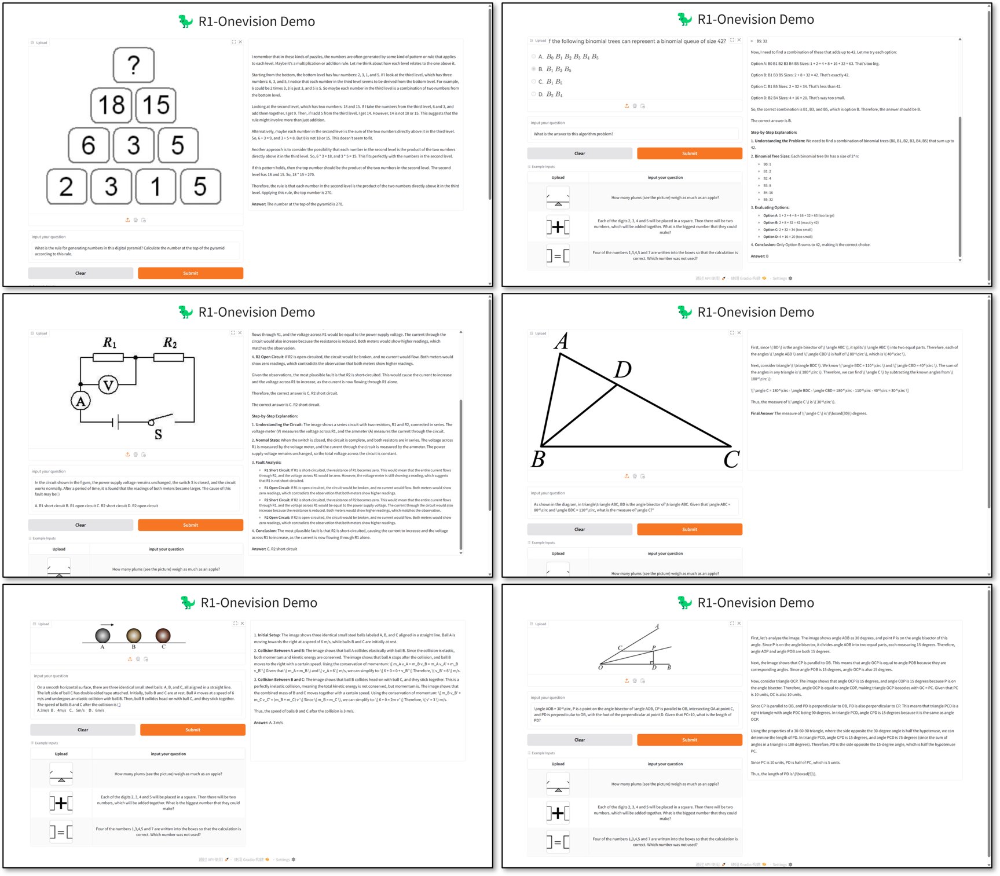

<div style="text-align: center;">
    
</div>


<b>🦖 R1-Onevision: Advancing Generalized Multimodal Reasoning through Cross-Modal Formalization </b>

<a href="https://huggingface.co/datasets/Fancy-MLLM/R1-onevision">🤗 Dataset</a> •
<a href="https://huggingface.co/datasets/Fancy-MLLM/R1-OneVision-Bench">🤗 Benchmark</a> •
<a href="https://huggingface.co/Fancy-MLLM/R1-OneVision-7B">🤗 SFT weights</a> •
<a href="https://huggingface.co/Fancy-MLLM/R1-OneVision-7B-RL">🤗 RL weights</a> •
<a href="https://huggingface.co/spaces/Fancy-MLLM/R1-OneVision">🤗 Demo</a> •
<a href="https://arxiv.org/pdf/2503.10615">📝 Paper</a>
</div>

**R1-OneVision** is a versatile **multimodal reasoning large model**, designed to tackle complex visual reasoning tasks. It seamlessly integrates visual and textual data to offer precise interpretations of multimodal information, excelling in areas such as mathematics, science, deep image understanding, and logical reasoning. With its robust ability to perform multimodal reasoning, **R1-OneVision emerges as a powerful AI assistant capable of addressing a wide range of problem-solving challenges across different domains**.



## 🗺️ Roadmap for R1-Onevision
> R1-Onevision is a multimodal reasoning model designed to bridge the gap between visual perception and deep reasoning. To achieve this, we propose a cross-modal reasoning pipeline that transforms images into formal textural representations, enabling precise language-based reasoning. Leveraging this pipeline, we construct the R1-Onevision dataset which provides detailed, step-by-step multimodal reasoning annotations across diverse domains. We further develop the R1-Onevision model through supervised fine-tuning and reinforcement learning to cultivate advanced reasoning and robust generalization abilities. To comprehensively evaluate multimodal reasoning performance across different grades, we introduce R1-Onevision-Bench, a benchmark aligned with human educational stages, covering exams from junior high school to university and beyond.
>
> Welcome Ideas and Contribution. Stay tuned!

## 🆕 News

> We have presented a versatile **multimodal reasoning large model**, **R1-Onevision**.🔥🔥🔥

- **[2025-03-11]** We have released the third version of dataset, models and benchmark. 🔥🔥🔥
- **[2025-02-24]** We have released the second version of dataset, models and benchmark. 🔥🔥🔥
- **[2025-02-12]** We have released the first version of [dataset](https://huggingface.co/datasets/Fancy-MLLM/R1-onevision), [hf models](https://huggingface.co/Fancy-MLLM/R1-OneVision-7B) and [reasoning benchmark](https://huggingface.co/datasets/Fancy-MLLM/R1-OneVision-Bench). For more details, please check our blog! 🔥🔥🔥

## 📊 Datasets, Models and Performance

### Datasets

The **R1-Onevision** dataset is a meticulously crafted resource designed to empower models with advanced multimodal reasoning capabilities. Aimed at bridging the gap between visual and textual understanding, this dataset provides rich, context-aware reasoning tasks across diverse domains, including natural scenes, science, mathematical problems, OCR-based content, and complex charts.

It combines high-quality data from LLaVA-OneVision with domain-specific datasets, each carefully selected and filtered to provide a solid foundation for complex visual reasoning tasks. With a focus on enabling deep reasoning and accurate model predictions, **R1-Onevision** equips models to handle a variety of visual and textual inputs, tackling intricate reasoning challenges with precision.

As shown in the chart, the R1-Onevision dataset is a carefully crafted tool designed to push the boundaries of multimodal reasoning. By combining advanced captioning techniques, innovative reasoning methodologies, and rigorous quality control, we’ve created a dataset that not only supports reasoning tasks but also enhances the ability of models to think deeply and critically.


### Models

This is a multimodal large language model fine-tuned from Qwen2.5-VL on the **R1-Onevision** dataset. The model enhances vision-language understanding and reasoning capabilities, making it suitable for various tasks such as visual reasoning, image understanding. With its robust ability to perform multimodal reasoning, R1-Onevision emerges as a powerful AI assistant capable of addressing a wide range of problem-solving challenges across different domains.

You can load the model using the Hugging Face `transformers` library:

```python
from transformers import AutoProcessor, Qwen2_5_VLForConditionalGeneration
import torch
from qwen_vl_utils import process_vision_info

MODEL_ID = "Fancy-MLLM/R1-Onevision-7B"
processor = AutoProcessor.from_pretrained(MODEL_ID, trust_remote_code=True)
model = Qwen2_5_VLForConditionalGeneration.from_pretrained(
    MODEL_ID,
    trust_remote_code=True,
    torch_dtype=torch.bfloat16
).to("cuda").eval()

messages = [
    {
        "role": "user",
        "content": [
            {"type": "image", "image": "<your image path>"},
            {"type": "text", "text": "Hint: Please answer the question and provide the final answer at the end. Question: Which number do you have to write in the last daisy?"},
        ],
    }
]

# Preparation for inference
text = processor.apply_chat_template(
    messages, tokenize=False, add_generation_prompt=True
)
image_inputs, video_inputs = process_vision_info(messages)
inputs = processor(
    text=[text],
    images=image_inputs,
    videos=video_inputs,
    padding=True,
    return_tensors="pt",
)
inputs = inputs.to(model.device)

generated_ids = model.generate(**inputs, max_new_tokens=4096)
generated_ids_trimmed = [
    out_ids[len(in_ids) :] for in_ids, out_ids in zip(inputs.input_ids, generated_ids)
]
output_text = processor.batch_decode(
    generated_ids_trimmed, skip_special_tokens=True, clean_up_tokenization_spaces=False
)
print(output_text)
```

### Experimental Performance


- For more details please read our paper.

## Acknowledgements
We would like to express our sincere gratitude to [DeepSeek](https://github.com/deepseek-ai/DeepSeek-R1), [Open-R1](https://github.com/huggingface/open-r1), [QwenVL](https://github.com/QwenLM/Qwen2.5-VL), [LLaMA-Factory](https://github.com/hiyouga/LLaMA-Factory), [VLM-R1](https://github.com/om-ai-lab/VLM-R1), and [VLMEvalKit](https://github.com/open-compass/VLMEvalKit) for providing open-source resources that contributed to the development of this project.


## 🧑‍💻 Institution
Zhejiang University

## Citation
If you find this code useful for your research, please use the following BibTeX entry.

```python
@article{yang2025r1onevision,
  title={R1-Onevision: Advancing Generalized Multimodal Reasoning through Cross-Modal Formalization},
  author={Yi Yang and Xiaoxuan He and Hongkun Pan and Xiyan Jiang and Yan Deng and Xingtao Yang and Haoyu Lu and Dacheng Yin and Fengyun Rao and Minfeng Zhu and Bo Zhang and Wei Chen},
  journal={arXiv preprint arXiv:2503.10615},
  year={2025},
}
```
