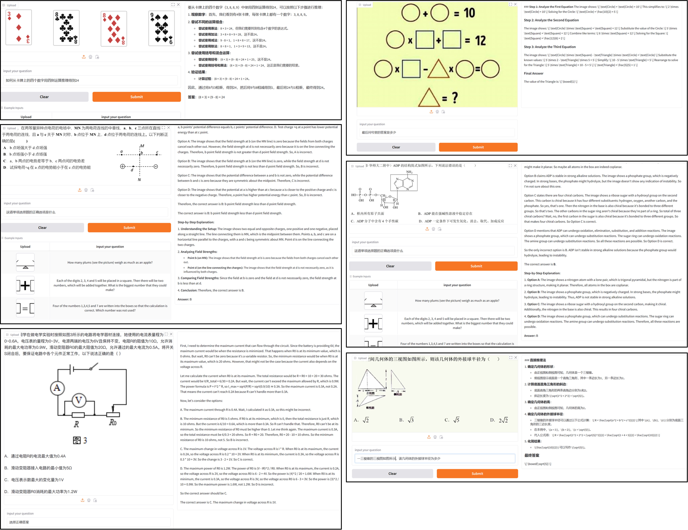

<div style="text-align: center;">
    
</div>


<b>🦖 R1-Onevision：An Open-Source Multimodal Large Language Model Capable of Deep Reasoning. </b>

<a href="https://huggingface.co/datasets/Fancy-MLLM/R1-onevision">🤗 HF Dataset</a> •
<a href="https://huggingface.co/datasets/Fancy-MLLM/R1-OneVision-Bench">🤗 Reasoning Benchmark</a> •
<a href="https://huggingface.co/Fancy-MLLM/R1-OneVision-7B">🤗 Model weights</a> •
<a href="https://huggingface.co/spaces/Fancy-MLLM/R1-OneVision">🤗 Demo</a> •
<a href="https://yangyi-vai.notion.site/r1-onevision?pvs=4">📝 Report</a>
</div>

**R1-OneVision** is a versatile **multimodal reasoning large model**, designed to tackle complex visual reasoning tasks. It seamlessly integrates visual and textual data to offer precise interpretations of multimodal information, excelling in areas such as mathematics, science, deep image understanding, and logical reasoning. With its robust ability to perform multimodal reasoning, **R1-OneVision emerges as a powerful AI assistant capable of addressing a wide range of problem-solving challenges across different domains**.



## 🗺️ Roadmap for R1-Onevision
> R1-Onevision bridges the gap between the multimodal capabilities of Qwen-VL and the deep reasoning abilities of DeepSeek-R1, creating a state-of-the-art multimodal reasoning model that goes beyond the capabilities of GPT-4o. 
>
> Welcome Ideas and Contribution. Stay tuned!

## 🆕 News

> We have presented a versatile **multimodal reasoning large model**, **R1-Onevision**.🔥🔥🔥


- **[2025-02-13]** We will release the second verson of dataset, models and code in next few days, Stay tuned! 🔥🔥🔥
- **[2025-02-12]** We have released the first verson of [dataset](https://huggingface.co/datasets/Fancy-MLLM/R1-onevision), [hf models](https://huggingface.co/Fancy-MLLM/R1-OneVision-7B) and [reasoning benchmark](https://huggingface.co/datasets/Fancy-MLLM/R1-OneVision-Bench). For more details, please check our blog! 🔥🔥🔥

## 📊 Datasets, Models and Performance

### Datasets

The **R1-Onevision** dataset is a meticulously crafted resource designed to empower models with advanced multimodal reasoning capabilities. Aimed at bridging the gap between visual and textual understanding, this dataset provides rich, context-aware reasoning tasks across diverse domains, including natural scenes, science, mathematical problems, OCR-based content, and complex charts.

It combines high-quality data from LLaVA-OneVision with domain-specific datasets, each carefully selected and filtered to provide a solid foundation for complex visual reasoning tasks. With a focus on enabling deep reasoning and accurate model predictions, **R1-Onevision** equips models to handle a variety of visual and textual inputs, tackling intricate reasoning challenges with precision.

As shown in the chart, the R1-Onevision dataset is a carefully crafted tool designed to push the boundaries of multimodal reasoning. By combining advanced captioning techniques, innovative reasoning methodologies, and rigorous quality control, we’ve created a dataset that not only supports reasoning tasks but also enhances the ability of models to think deeply and critically.


### Models

This is a multimodal large language model fine-tuned from Qwen2.5-VL on the **R1-Onevision** dataset. The model enhances vision-language understanding and reasoning capabilities, making it suitable for various tasks such as visual reasoning, image understanding. With its robust ability to perform multimodal reasoning, R1-Onevision emerges as a powerful AI assistant capable of addressing a wide range of problem-solving challenges across different domains.

You can load the model using the Hugging Face `transformers` library:

```python
from transformers import AutoProcessor, Qwen2_5_VLForConditionalGeneration
import torch
from qwen_vl_utils import process_vision_info

MODEL_ID = "Fancy-MLLM/R1-Onevision-7B"
processor = AutoProcessor.from_pretrained(MODEL_ID, trust_remote_code=True)
model = Qwen2_5_VLForConditionalGeneration.from_pretrained(
    MODEL_ID,
    trust_remote_code=True,
    torch_dtype=torch.bfloat16
).to("cuda").eval()

messages = [
    {
        "role": "user",
        "content": [
            {"type": "image", "image": "<your image path>"},
            {"type": "text", "text": "Hint: Please answer the question and provide the final answer at the end. Question: Which number do you have to write in the last daisy?"},
        ],
    }
]

# Preparation for inference
text = processor.apply_chat_template(
    messages, tokenize=False, add_generation_prompt=True
)
image_inputs, video_inputs = process_vision_info(messages)
inputs = processor(
    text=[text],
    images=image_inputs,
    videos=video_inputs,
    padding=True,
    return_tensors="pt",
)
inputs = inputs.to(model.device)

generated_ids = model.generate(**inputs, max_new_tokens=4096)
generated_ids_trimmed = [
    out_ids[len(in_ids) :] for in_ids, out_ids in zip(inputs.input_ids, generated_ids)
]
output_text = processor.batch_decode(
    generated_ids_trimmed, skip_special_tokens=True, clean_up_tokenization_spaces=False
)
print(output_text)
```

### Performance

We evaluated R1-Onevision on Mathvision, Mathverse and R1-Onevision-Bench, and our model exhibits stronger reasoning performance than Qwen2.5-VL-72B and GPT-4V. The evaluation results are as follows:

|  | R1-Onevision-Bench | Mathverse | Mathvision |
| --- | --- | --- | --- |
| Qwen2.5-VL-7B | 27.95 | 37.35 | 23.20 |
| GPT-4V | - | 39.40 | 22.76 |
| GPT-4o | 32.07 | 43.22 | 30.39 |
| R1-Onevision | 41.71 | 44.06 | 26.16 |

## 🏗️ Start

- Framework: The training process uses the open-source **LLama-Factory** library, with **Qwen2.5-VL-Instruct** as the base model. This model comes in three variants: 3B, 7B, and 72B.
- Parameters: For efficiency, we use a resolution of 512 for image inputs to save GPU memory. The training follows a full model SFT (Supervised Fine-Tuning) approach with a learning rate of 1e-5, trained for one epoch.
    
The training configuration is as follows:
```python
image_resolution: 512
cutoff_len: 8192
per_device_train_batch_size: 1
gradient_accumulation_steps: 16
learning_rate: 1.0e-5
num_train_epochs: 1.0
lr_scheduler_type: cosine
warmup_ratio: 0.05
bf16: true
flash_attn: fa2
```

Training loss curve:


## 🧑‍💻 Institution
Zhejiang University
